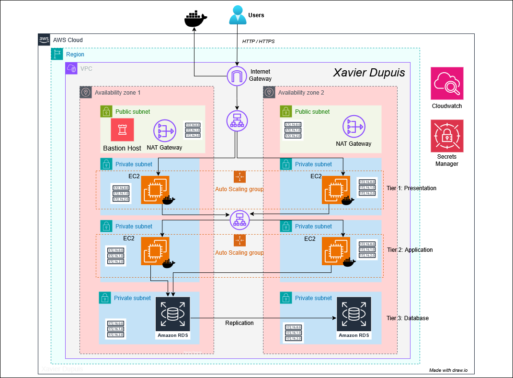
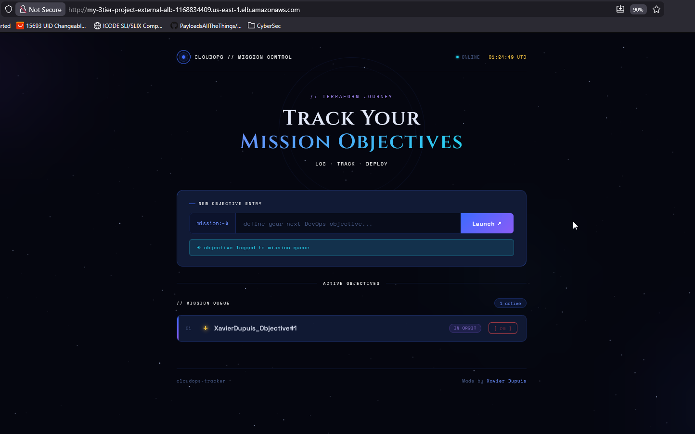
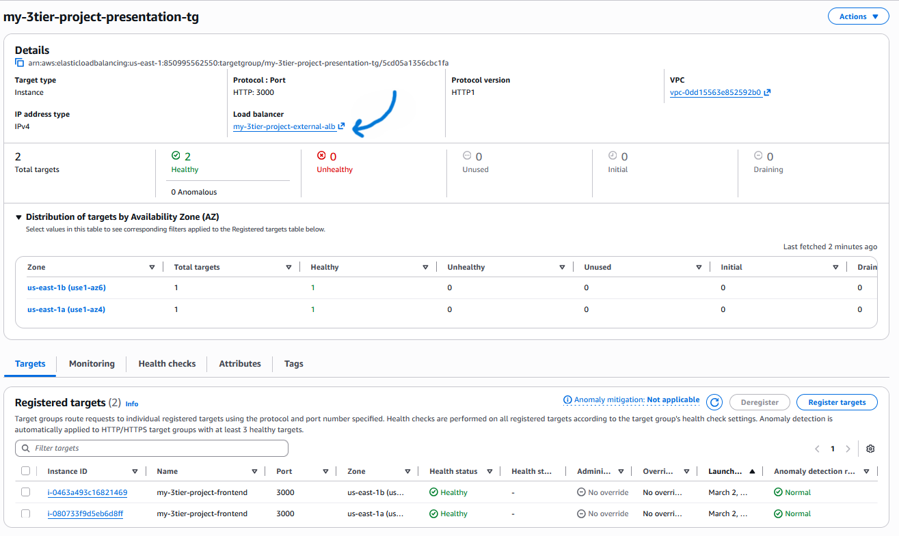
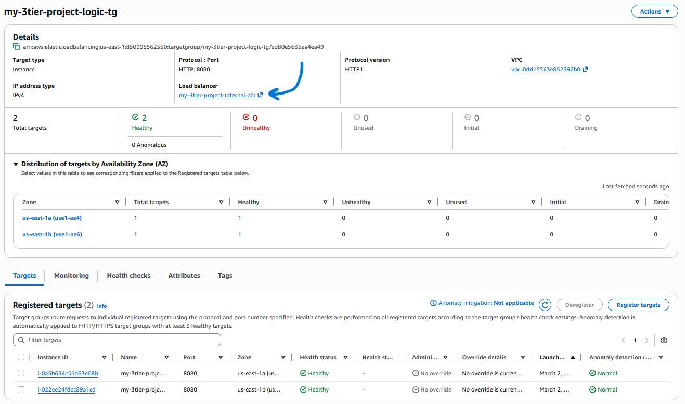
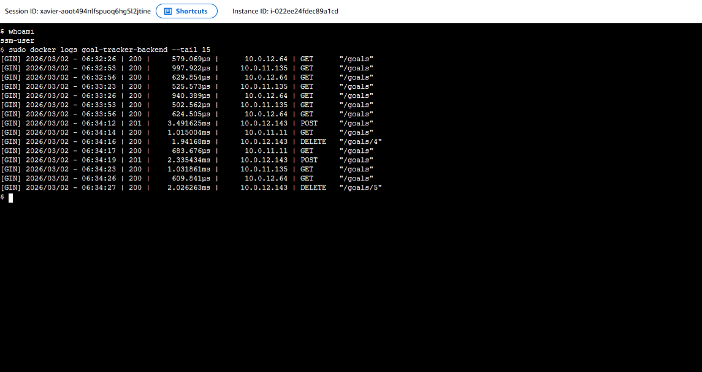
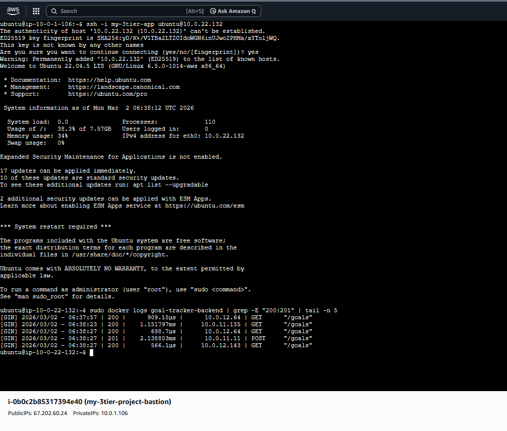

# 🚀 Scalable 3-Tier Web Infrastructure on AWS
### High-Availability "Goal Tracker" Deployment on AWS via Terraform

This repository contains the complete Infrastructure as Code (IaC) for a secure, scalable, and highly available 3-tier web application. This project is a demonstration of modern Cloud Engineering, focusing on **network isolation**, **immutable infrastructure**, and **automated secret management**. It features a a **Dockerized** stack consisting of a **React** frontend, a **Go** (Golang) REST API, and a **PostgreSQL** RDS database, all orchestrated within a custom-designed AWS VPC across multiple Availability Zones.

---

## 🗺️ Architecture Visualization

<p align="center">
  
</p>

> *Architecture Overview: Multi-AZ VPC design featuring high-availability, automated failover, and strict network isolation for private application and database tiers.*
---

## 🏗️ The Architecture Stack
* **Infrastructure:** Terraform (Modularized)
* **Cloud Provider:** AWS (Global Infrastructure)
* **Compute:** EC2 Auto Scaling Groups (Frontend & Backend)
* **Database:** AWS RDS PostgreSQL 15.x (Multi-AZ Deployment)
* **Networking:** VPC, NAT Gateways, Internet Gateway, 2x Application Load Balancers
* **Security:** AWS Secrets Manager, IAM Roles (Least Privilege), Bastion Host, Security Groups
* **Application:** Dockerized Go (Backend) & React/HTML (Frontend)

---

## 🛰️ Technical Deep Dive

### 1. Network Topology (VPC Design)
The network is partitioned into **4 distinct subnet layers** across multiple Availability Zones (AZs) to ensure 99.9% availability (fault tolerance):
* **Public Tier:** Houses the External Application Load Balancer (ALB) and a hardened **Bastion Host**.
* **Web Tier - Presentation (Private):** Isolated subnet for the React Frontend ASG. Accessible only via the External ALB.
* **App Tier - Logic (Private):** Isolated subnet for the Go Backend ASG and **Internal ALB**.
* **Data Tier - DB (Private):** Strictly isolated subnet for the Multi-AZ RDS instance, with ingress restricted to the App Tier only.


### 2. Containerization Strategy
Both the Frontend and Backend are decoupled from the host OS using Docker. 
* **Multi-stage Builds:** Optimized Dockerfiles to keep image sizes small and secure.
* **User-Data Injection:** Terraform `user_data` scripts automatically pull the latest images from Docker Hub, configure environment variables, and launch containers upon instance initialization.

### 3. Security & Automated Secret Management
* **Zero-Knowledge Deployment:** Database credentials are generated by Terraform using `random_password` and stored in **AWS Secrets Manager**.
* **IAM Least Privilege:** Instances use IAM Roles to dynamically fetch secrets at runtime. No `.env` files or hardcoded strings are stored in the repository.
* **SSM Access:** Attached `AmazonSSMManagedInstanceCore` allows for terminal access via AWS Systems Manager, removing the need to manage global SSH keys.

### 4. Self-Healing Compute
Both the Frontend and Backend are wrapped in **Auto Scaling Groups**. If an instance fails a health check on the `/goals` endpoint, the ALB automatically drains traffic, and the ASG terminates and replaces the instance.


---

## 📸 Project Verification (Proof of Work)

### I. Application Functionality
The full stack communication is verified here. The user adds a goal on the UI, which travels through two Load Balancers and is written to the persistent RDS layer.

<p align="center">
  
</p>

### II. Infrastructure Health & Target Groups
This view confirms that the AWS health checks are passing across the AZs.


<p align="center">
  
</p>
<p align="center">
  
</p>

### III. Multi-Vector Secure Administrative Access

To maintain a "Zero Public Exposure" policy for the database and application logic, I implemented two secure methods for administrative maintenance and verification.

#### **1. AWS Systems Manager (SSM) - Keyless Access**
Using **Session Manager**, I can access the backend shell directly through the AWS Console. This method is highly secure as it requires no open inbound ports (Port 22 is closed) and uses IAM for authentication rather than static SSH keys.

> **Verification:** Below shows a Session Manager terminal on the private backend instance, verifying the containerized Go engine is active and processing requests.

<p align="center">
  
</p>

#### **2. SSH ProxyJump via Bastion Host - Network Isolation**
For standard administrative tasks, I utilized a hardened **Bastion Host** (Jump Box) located in the public subnet. This validates the VPC routing logic, proving that the private backend is reachable only via the authorized internal gateway (in this case, the bastion host).


> **Verification:** This screenshot demonstrates a secure shell "hop" initiated from the Bastion gateway into the private backend (`10.0.22.132`). The terminal logs confirm a successful handshake between the Go API and the RDS PostgreSQL instance.

<p align="center">
  
</p>


> *The output in these screenshots is a live "heartbeat" of your app. Every 30 seconds, you see **GET /goals**, which is the **Load Balancer** checking to make sure the server is still running. When you see **POST /goals** or **DELETE**, it means a user actually clicked a button on the website to add or remove a goal. Because all the IP addresses start with **10.0.**, it proves that your website is talking privately and securely within your own cloud network, rather than being exposed directly to the open internet.*
---

## 🚀 Deployment Guide

### 1. Initialize & Workspace Setup
```
terraform init
```

### 2. Preview Changes
```
terraform plan
```

### 3. Apply Infrastructure
```
terraform apply
```

### 4. Cleanup
```
terraform destroy
```

## 💡 Key Design Decisions
* **Why Internal ALB?** To prevent "Side-Channel" attacks. The API is only reachable from within the VPC, providing an extra layer of security.
* **Why Multi-AZ RDS?** To provide high availability. If the primary DB fails, AWS flips the DNS to the standby in seconds with zero manual intervention.
* **Why SSM Managed Policy?** To allow for terminal access via the AWS Console (Session Manager), reducing the attack surface of Port 22 and eliminating the need to manage SSH keys globally.

# 👨‍💻 Author

**Xavier Dupuis**\
At this time, I have:\
Bachelor in Cybersecurity - May 2026\
AWS Certified Cloud Practitioner\
AWS Certified Solutions Architect -- Associate\
AWS Certified Security -- Specialty\
[...]

------------------------------------------------------------------------

This project demonstrates secure, scalable, and production-ready AWS
infrastructure by design.